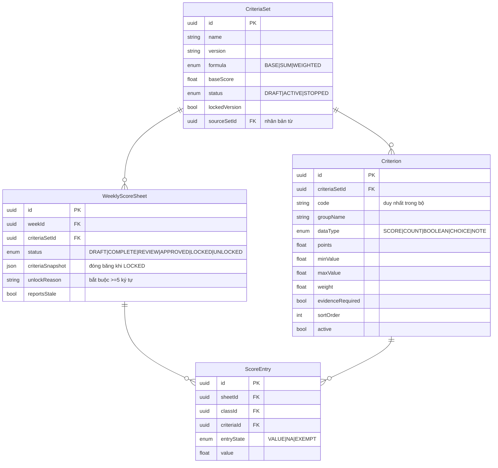

# DATABASE_DESIGN.md

> Thiết kế cơ sở dữ liệu PostgreSQL cho **Trợ lý Tổng phụ trách Đội THCS**
> Suy dẫn từ nghiệp vụ thực tế của website gốc — xem `CLONE_ANALYSIS.md`
> ORM: Prisma · DB: PostgreSQL 16

---

## 1. Nguyên tắc thiết kế

### 1.1 Từ UI → Database (không tự bịa bảng)

Mọi bảng dưới đây được suy dẫn theo đúng chuỗi bắt buộc:

```
UI (màn hình gốc)
  ↓ trường nhập liệu thật trong form
Form (ENTITY.fields / taskForm / criterionForm / …)
  ↓ dữ liệu thật ghi vào IndexedDB
Data (db.put(store, {...}))
  ↓ ràng buộc thật trong mã
Business Logic (validation, workflow, tính toán)
  ↓
Entity
  ↓
Database (bảng PostgreSQL)
```

**Không có bảng nào được thêm vì "có vẻ hợp lý".** Mỗi bảng đều truy vết được về một màn hình hoặc một đoạn logic cụ thể trong `index.html` gốc.

### 1.2 Phân loại 65 object store gốc

| Nhóm | Số lượng | Xử lý |
|---|---|---|
| **Có nghiệp vụ thật, có ghi dữ liệu** | 44 | → Bảng PostgreSQL đầy đủ |
| **Khai báo nhưng chưa dùng** (chỉ xuất hiện trong mảng `STORES`) | 15 | → Xem §7 |
| **Đặc thù trình duyệt, không chuyển** | 6 | → Loại bỏ, xem §8 |

Danh sách 15 store **khai báo nhưng chưa dùng** ở bản gốc:
`profiles`, `grades`, `homeroom_teachers`, `plan_targets`, `task_dependencies`, `activity_categories`, `activity_classes`, `activity_check_items`, `criteria_groups`, `score_evidence`, `team_positions`, `equipment_transactions`, `report_templates`, `task_templates`, `score_component_versions`

Trong đó **6 store được logic gốc tham chiếu tới** dù chưa có màn hình ghi dữ liệu — sẽ tạo bảng để hoàn chỉnh mô hình:

| Store | Bằng chứng tham chiếu |
|---|---|
| `score_evidence` | `renderScoreAnomalies` kiểm tra `e.evidence_id` |
| `task_dependencies` | Mô tả trang Tasks: *"theo dõi đầu việc, hạn, **phụ thuộc**"* |
| `equipment_transactions` | Mô tả trang Equipment: *"kiểm kê, **mượn–trả**"* |
| `plan_targets` | ENTITY plans có trường `targets` (Chỉ tiêu đo được) |
| `task_templates` | `showTaskTemplates()` hiện hard-code 16 mẫu |
| `homeroom_teachers` | `classes.teacher` hiện là text tự do |

9 store còn lại (`profiles`, `grades`, `activity_categories`, `activity_classes`, `activity_check_items`, `criteria_groups`, `team_positions`, `report_templates`, `score_component_versions`) **không tạo bảng** vì không có bất kỳ nghiệp vụ nào chạm tới — tạo ra sẽ là bảng chết, vi phạm Phase 19 (không dead code).

### 1.3 Quy ước chung mọi bảng

Theo `RELEASE_MANIFEST.json` gốc, record identity là:

```
stable UUID + school/year + revision + device_id + tombstone
```

Ánh xạ sang PostgreSQL:

```prisma
id        String    @id @default(uuid()) @db.Uuid
createdAt DateTime  @default(now())      @map("created_at")
updatedAt DateTime  @updatedAt           @map("updated_at")
deletedAt DateTime?                      @map("deleted_at")   // tombstone — xóa mềm
revision  Int       @default(1)                               // optimistic locking
```

**Xóa mềm (`deletedAt`)** là bắt buộc — bản gốc ghi rõ trong modal xóa:
> *"Bản ghi sẽ được xóa mềm và vẫn còn trong nhật ký."*

**Optimistic locking (`revision`)** tái hiện `RevisionConflictError` của bản gốc:
```js
if (existing && Number(row.revision) !== Number(existing.revision)) {
  conflict = new Error("Bản ghi đã thay đổi ở nơi khác; dữ liệu chưa được ghi đè.");
  conflict.name = "RevisionConflictError";
}
```
→ API mới trả **HTTP 409 Conflict** trong tình huống tương ứng.

Quy ước đặt tên: **model PascalCase** (Prisma) ↔ **bảng snake_case** (PostgreSQL) qua `@@map`; **field camelCase** ↔ **cột snake_case** qua `@map`.

---

## 2. Sơ đồ quan hệ (ERD)

### 2.1 Tổng thể

```mermaid
erDiagram
    School     ||--o{ Campus         : "có"
    School     ||--o{ SchoolYear     : "có"
    SchoolYear ||--o{ Semester       : "chia thành"
    SchoolYear ||--o{ SchoolWeek     : "40 tuần"
    SchoolYear ||--o{ Class          : "gồm"
    Campus     ||--o{ Class          : "thuộc"
    Class      ||--o{ HomeroomTeacher: "GVCN"

    SchoolYear ||--o{ CriteriaSet    : "áp dụng"
    CriteriaSet||--o{ Criterion      : "gồm"
    Semester   ||--o{ CriteriaSet    : "giới hạn"

    SchoolWeek  ||--o{ WeeklyScoreSheet : "bảng tuần"
    CriteriaSet ||--o{ WeeklyScoreSheet : "dùng bộ"
    WeeklyScoreSheet ||--o{ ScoreEntry  : "chứa ô"
    Class       ||--o{ ScoreEntry       : "được chấm"
    Criterion   ||--o{ ScoreEntry       : "theo tiêu chí"
    ScoreEntry  ||--o| ScoreEvidence    : "minh chứng"
    WeeklyScoreSheet ||--o{ RankingSnapshot : "đóng băng"

    SchoolYear ||--o{ Plan          : ""
    Plan       ||--o{ PlanTarget    : "chỉ tiêu"
    SchoolYear ||--o{ Task          : ""
    Task       ||--o{ TaskCheckItem : "checklist"
    Task       ||--o{ TaskDependency: "phụ thuộc"
    Task       ||--o{ Task          : "sinh việc lặp"
    SchoolYear ||--o{ CalendarEvent : ""
    SchoolYear ||--o{ Activity      : ""
    SchoolYear ||--o{ TeamMember    : ""
    TeamUnit   ||--o{ TeamMember    : "thuộc"
    TeamMember ||--o{ TrainingRecord: "bồi dưỡng"
    SchoolYear ||--o{ ProgramResult : ""
    SchoolYear ||--o{ Commendation  : ""

    DocumentFolder ||--o{ Document    : "chứa"
    Document   ||--o{ Attachment      : "tệp"
    Attachment ||--o{ FileVersion     : "phiên bản"
    Document   ||--o{ DocumentLink    : "liên kết"

    SchoolYear ||--o{ Equipment            : ""
    Equipment  ||--o{ EquipmentTransaction : "mượn-trả"

    SchoolYear ||--o{ GeneratedReport : ""
    SchoolYear ||--o{ ReportPackage   : "gói chốt"

    ConfigCategory ||--o{ ConfigItem : "gồm"

    User ||--o{ AuditLog  : "thực hiện"
    User ||--o{ Session   : "phiên"
```

### 2.2 Cụm Thi đua (chi tiết — cụm quan trọng nhất)



---

## 3. Đặc tả bảng

### 3.1 Xác thực & người dùng *(MỚI — thay thế mật khẩu hard-code)*

Bản gốc **không có** khái niệm người dùng. Đây là bổ sung bắt buộc theo Phase 5.

#### `users`

| Cột | Kiểu | Ràng buộc | Nguồn gốc |
|---|---|---|---|
| `id` | UUID | PK | mới |
| `username` | VARCHAR(64) | **UNIQUE**, NOT NULL | mới |
| `email` | VARCHAR(160) | UNIQUE, NULL | mới |
| `password_hash` | TEXT | NOT NULL | thay `"admin@"` hard-code |
| `full_name` | VARCHAR(120) | NOT NULL | mới |
| `role` | ENUM | `ADMIN`\|`EDITOR`\|`VIEWER`, default `EDITOR` | mới |
| `active` | BOOLEAN | default `true` | mới |
| `failed_attempts` | INT | default 0 | tái hiện `SessionLockManager.failedAttempts` |
| `blocked_until` | TIMESTAMPTZ | NULL | tái hiện `blockedUntil` (backoff mũ 2) |
| `last_login_at` | TIMESTAMPTZ | NULL | mới |
| `auto_lock_minutes` | INT | default 10 | từ `app_settings.auto_lock_minutes` |

> **Backoff giữ nguyên thuật toán gốc:** `delay = attempts < 3 ? 0 : min(30, 2^(attempts-3))` giây — nhưng nay thực thi **phía server** nên không thể bypass bằng DevTools.

#### `sessions` (refresh token)

| Cột | Kiểu | Ghi chú |
|---|---|---|
| `id` | UUID | PK |
| `user_id` | UUID | FK → users, CASCADE |
| `token_hash` | TEXT | SHA-256 của refresh token — **không lưu token thô** |
| `expires_at` | TIMESTAMPTZ | |
| `revoked_at` | TIMESTAMPTZ | NULL |
| `user_agent` | TEXT | |
| `ip_address` | VARCHAR(45) | IPv6-safe |

`@@index([userId])`, `@@index([tokenHash])`

---

### 3.2 Cơ cấu tổ chức trường

#### `schools`
Nguồn: `renderSchoolPanel()` — form "Thông tin trường".

| Cột | Kiểu | Ràng buộc | Trường form gốc |
|---|---|---|---|
| `id` | UUID | PK | |
| `name` | VARCHAR(200) | NOT NULL | "Tên trường" * |
| `code` | VARCHAR(50) | | "Mã trường" |
| `address` | VARCHAR(300) | | "Địa chỉ" |
| `reporter` | VARCHAR(120) | | "Người lập báo cáo" |
| `reporter_title` | VARCHAR(120) | default `'Tổng phụ trách Đội'` | "Chức danh" |
| `is_sample` | BOOLEAN | default false | `ensureSeed()` |

#### `campuses`
Nguồn: `campusForm()` / `deleteCampus()`.

| Cột | Kiểu | Ràng buộc |
|---|---|---|
| `id` | UUID | PK |
| `school_id` | UUID | FK → schools |
| `name` | VARCHAR(120) | NOT NULL, **UNIQUE** (chuẩn hóa bỏ dấu) |
| `code` | VARCHAR(30) | NOT NULL, **UNIQUE**, pattern `^[A-Za-z0-9_-]+$`, uppercase |

**Ràng buộc nghiệp vụ (thực thi ở service layer, không phải DB):**
- Phải giữ **≥ 1 cơ sở** — *"Phải giữ lại ít nhất một cơ sở."*
- **Không xóa được** nếu còn tham chiếu — kiểm tra 16 bảng: `classes`, `plans`, `tasks`, `calendar_events`, `activities`, `criteria_sets`, `weekly_score_sheets`, `score_entries`, `ranking_snapshots`, `team_units`, `training_records`, `programs`, `commendations`, `documents`, `equipment`, `generated_reports`.

`@@unique([code])`, `@@index([schoolId])`

#### `school_years`
Nguồn: `yearForm()`, `showCreateAcademicYear()`, `closeAcademicYear()`.

| Cột | Kiểu | Ràng buộc |
|---|---|---|
| `id` | UUID | PK |
| `school_id` | UUID | FK → schools |
| `name` | VARCHAR(50) | NOT NULL, UNIQUE — vd `"2026–2027"` |
| `start_date` | DATE | NOT NULL |
| `end_date` | DATE | NOT NULL, **CHECK `end_date > start_date`** |
| `is_current` | BOOLEAN | default false — **chỉ 1 bản ghi `true`** |
| `status` | ENUM | `OPEN`\|`ARCHIVED`, default `OPEN` |
| `read_only` | BOOLEAN | default false |
| `closed_at` | TIMESTAMPTZ | NULL |

> Validation gốc: *"Ngày kết thúc phải sau ngày bắt đầu."*
> Đặt `is_current = true` → transaction đặt mọi năm khác về `false`.

`@@unique([schoolId, name])`, `@@index([isCurrent])`

#### `semesters`

| Cột | Kiểu | Ràng buộc |
|---|---|---|
| `id` | UUID | PK |
| `school_year_id` | UUID | FK → school_years, CASCADE |
| `name` | VARCHAR(50) | NOT NULL — `"Học kỳ I"` / `"Học kỳ II"` |
| `start_date` | DATE | NOT NULL |
| `end_date` | DATE | NOT NULL |
| `sort_order` | INT | default 1 |

`@@unique([schoolYearId, name])`

#### `school_weeks`
Sinh tự động **40 tuần**, mỗi tuần 7 ngày, từ `start_date` của năm.

| Cột | Kiểu | Ràng buộc |
|---|---|---|
| `id` | UUID | PK |
| `school_year_id` | UUID | FK → school_years, CASCADE |
| `semester_id` | UUID | FK → semesters, NULL |
| `number` | INT | NOT NULL, 1–40 |
| `name` | VARCHAR(40) | `"Tuần {n}"` |
| `start_date` | DATE | NOT NULL |
| `end_date` | DATE | NOT NULL = `start_date + 6` |

`@@unique([schoolYearId, number])`, `@@index([schoolYearId, startDate])`

#### `classes`
Nguồn: `classForm()`, `showClassImport()`.

| Cột | Kiểu | Ràng buộc |
|---|---|---|
| `id` | UUID | PK |
| `school_year_id` | UUID | FK → school_years, CASCADE |
| `campus_id` | UUID | FK → campuses, RESTRICT |
| `code` | VARCHAR(30) | từ import CSV cột 1 |
| `class_name` | VARCHAR(50) | NOT NULL, **UNIQUE trong năm học** |
| `grade` | INT | NOT NULL, **CHECK 1–9** |
| `teacher` | VARCHAR(120) | GVCN (text tự do như bản gốc) |
| `homeroom_teacher_id` | UUID | FK → homeroom_teachers, NULL |
| `active` | BOOLEAN | default true |
| `is_sample` | BOOLEAN | default false |

> Validation gốc: *"Tên lớp đã tồn tại trong năm học."* (so sánh không phân biệt hoa/thường)
> Sắp xếp: `localeCompare(vi, {numeric:true})` → PostgreSQL dùng collation `vi-VN-x-icu` + `NULLS LAST`.

`@@unique([schoolYearId, className])`, `@@index([campusId])`, `@@index([schoolYearId, active])`

#### `homeroom_teachers` *(hoàn chỉnh mô hình)*

| Cột | Kiểu |
|---|---|
| `id` | UUID PK |
| `school_year_id` | UUID FK |
| `full_name` | VARCHAR(120) NOT NULL |
| `phone` / `email` | VARCHAR |
| `note` | TEXT |

---

### 3.3 Kế hoạch

#### `plans`
Nguồn: `ENTITY.plans.fields` — **13 trường, khớp 1-1**.

| Cột | Kiểu | Bắt buộc | Nhãn form gốc |
|---|---|---|---|
| `id` | UUID PK | | |
| `school_year_id` | UUID FK | | (phạm vi) |
| `semester_id` | UUID FK NULL | | (phạm vi) |
| `campus_id` | UUID FK NULL | | "Cơ sở áp dụng" |
| `code` | VARCHAR(50) | ✅ | Mã kế hoạch |
| `name` | VARCHAR(200) | ✅ | Tên kế hoạch |
| `level` | ENUM `YEAR\|SEMESTER\|MONTH\|WEEK` | ✅ | Cấp kế hoạch |
| `start_date` | DATE | ✅ | Bắt đầu |
| `end_date` | DATE | ✅ | Kết thúc |
| `objectives` | TEXT | ✅ | Mục tiêu |
| `targets` | TEXT | | Chỉ tiêu đo được |
| `basis` | TEXT | | Căn cứ/văn bản liên quan |
| `coordination` | VARCHAR(200) | | Đơn vị phối hợp |
| `resources` | VARCHAR(200) | | Nguồn lực |
| `risks` | TEXT | | Rủi ro và phương án |
| `status` | ENUM `DRAFT\|ACTIVE\|FINISHED` | ✅ | Trạng thái |
| `progress` | INT default 0 | | Tiến độ (%) — CHECK 0–100 |
| `custom_values` | JSONB | | trường tùy chỉnh |

`@@index([schoolYearId, campusId])`, `@@index([status])`

#### `plan_targets` *(hoàn chỉnh mô hình)*

| Cột | Kiểu |
|---|---|
| `id` | UUID PK |
| `plan_id` | UUID FK → plans CASCADE |
| `name` | VARCHAR(200) NOT NULL |
| `target_value` / `actual_value` | DECIMAL(12,2) |
| `unit` | VARCHAR(30) |
| `sort_order` | INT |

---

### 3.4 Công việc

#### `tasks`
Nguồn: `taskForm()` + `generateRecurringTasks()`.

| Cột | Kiểu | Ràng buộc | Nguồn |
|---|---|---|---|
| `id` | UUID | PK | |
| `school_year_id` | UUID | FK | phạm vi |
| `semester_id` | UUID | FK NULL | phạm vi |
| `campus_id` | UUID | FK NULL | "Cơ sở" |
| `title` | VARCHAR(200) | NOT NULL | "Tiêu đề" * (maxlength 200) |
| `group_name` | VARCHAR(80) | | "Nhóm nghiệp vụ" (danh mục `task_group`) |
| `start_date` | DATE | | "Ngày bắt đầu" |
| `due_date` | DATE | NOT NULL | "Hạn hoàn thành" * |
| `priority` | ENUM | `LOW\|NORMAL\|HIGH\|URGENT` default `NORMAL` | "Ưu tiên" |
| `status` | ENUM | `TODO\|DOING\|WAITING\|REVIEW\|DONE\|PAUSED` default `TODO` | "Trạng thái" |
| `progress` | INT | default 0, **CHECK 0–100** | "Tiến độ (%)" |
| `coordination` | VARCHAR(200) | | "Người/bộ phận phối hợp" |
| `obstacle` | TEXT | | "Trở ngại" |
| `notes` | TEXT | | "Ghi chú/kết quả" |
| `repeat_rule` | ENUM | `NONE\|DAILY\|WEEKLY\|MONTHLY\|YEARLY` default `NONE` | "Chu kỳ lặp" |
| `repeat_until` | DATE | NULL | "Kết thúc lặp" |
| `repeat_next_at` | DATE | NULL | tính bởi `nextRepeatDate()` |
| `repeat_source_id` | UUID | FK → tasks (self) NULL | việc gốc sinh ra việc này |
| `repeat_occurrence_key` | VARCHAR(120) | **UNIQUE** NULL | `"{sourceId}:{dueDate}"` chống trùng |
| `custom_values` | JSONB | | |
| `is_sample` | BOOLEAN | default false | |

**Ràng buộc nghiệp vụ:**
1. `due_date >= start_date` — *"Hạn hoàn thành phải từ ngày bắt đầu trở đi."*
2. Không cho `status = DONE` nếu còn `task_check_items.required = true AND done = false` — *"Chưa thể hoàn thành vì còn checklist bắt buộc chưa xong."*
3. `repeat_rule = NONE` → `repeat_next_at = NULL`, `repeat_until = NULL`.

`@@unique([repeatOccurrenceKey])`, `@@index([schoolYearId, status])`, `@@index([dueDate])`, `@@index([campusId])`, `@@index([repeatNextAt])`

#### `task_check_items`

| Cột | Kiểu | Ghi chú |
|---|---|---|
| `id` | UUID PK | |
| `task_id` | UUID FK → tasks CASCADE | |
| `label` | VARCHAR(200) NOT NULL | dòng textarea, bỏ tiền tố `!` |
| `required` | BOOLEAN default false | dòng bắt đầu bằng `!` |
| `done` | BOOLEAN default false | **giữ nguyên khi sửa** nếu label khớp (so sánh chuẩn hóa bỏ dấu) |
| `sort_order` | INT | thứ tự dòng |

`@@index([taskId, sortOrder])`

#### `task_dependencies` *(hoàn chỉnh mô hình)*

| Cột | Kiểu |
|---|---|
| `id` | UUID PK |
| `task_id` | UUID FK → tasks CASCADE |
| `depends_on_id` | UUID FK → tasks RESTRICT |
| `type` | ENUM `FINISH_TO_START\|START_TO_START` |

`@@unique([taskId, dependsOnId])` · **CHECK `task_id <> depends_on_id`**

#### `task_templates` *(chuyển 16 mẫu hard-code thành dữ liệu)*

| Cột | Kiểu |
|---|---|
| `id` | UUID PK |
| `title` | VARCHAR(200) NOT NULL |
| `group_name` | VARCHAR(80) default `'Mẫu tham khảo'` |
| `default_due_offset_days` | INT default 7 |
| `sort_order` | INT |
| `active` | BOOLEAN default true |

---

### 3.5 Lịch & Hoạt động

#### `calendar_events`
Nguồn: `eventForm()`.

| Cột | Kiểu | Bắt buộc |
|---|---|---|
| `id` | UUID PK | |
| `school_year_id` / `campus_id` | UUID FK | |
| `title` | VARCHAR(200) | ✅ |
| `date` | DATE | ✅ |
| `time` | VARCHAR(5) | `"HH:MM"` |
| `location` | VARCHAR(200) | |
| `leader` | VARCHAR(120) | |
| `category` | VARCHAR(80) | default `'Hoạt động Đội'` (danh mục `calendar_type`) |
| `reminder_hours` | INT default 24 | |
| `safety` | TEXT | checklist an toàn |

> **Cảnh báo mềm** (không chặn lưu): thiếu `location` ∨ `leader` ∨ `safety` → API trả `warnings[]`, UI hiện toast đỏ *"Đã lưu; còn thiếu địa điểm, phụ trách hoặc checklist an toàn."*

`@@index([schoolYearId, date])`

#### `activities`
Nguồn: `ENTITY.activities.fields` — **12 trường**.

| Cột | Kiểu | Bắt buộc | Nhãn gốc |
|---|---|---|---|
| `name` | VARCHAR(200) | ✅ | Tên hoạt động |
| `category` | VARCHAR(100) | ✅ | Nhóm hoạt động (danh mục `activity_type`) |
| `theme` | VARCHAR(150) | | Chủ điểm |
| `date` | DATE | ✅ | Ngày tổ chức |
| `location` | VARCHAR(200) | ✅ | Địa điểm |
| `leader` | VARCHAR(120) | ✅ | Người phụ trách |
| `participants` | VARCHAR(200) | | Đối tượng/quy mô |
| `objectives` | TEXT | | Mục tiêu |
| `safety` | TEXT | ✅ | **Phương án an toàn** |
| `backup_plan` | TEXT | | Phương án dự phòng |
| `result` | TEXT | | Kết quả sau hoạt động |
| `status` | ENUM `PLANNED\|ACTIVE\|FINISHED` | ✅ | Trạng thái |

`@@index([schoolYearId, date])`, `@@index([status])`

---

### 3.6 Thi đua — cụm trung tâm

#### `criteria_sets`
Nguồn: `showCriteriaConfig()`, `criteriaSetForm()`, `cloneCriteriaSet()`.

| Cột | Kiểu | Ràng buộc |
|---|---|---|
| `id` | UUID | PK |
| `school_year_id` | UUID | FK |
| `semester_id` | UUID | FK NULL — `NULL` = mọi học kỳ |
| `campus_id` | UUID | FK NULL — `NULL` = toàn trường |
| `name` | VARCHAR(200) | NOT NULL |
| `version` | VARCHAR(20) | default `'1.0'` |
| `formula` | ENUM | `BASE`\|`SUM`\|`WEIGHTED` default `BASE` |
| `base_score` | DECIMAL(8,2) | default 100 |
| `status` | ENUM | `DRAFT`\|`ACTIVE`\|`STOPPED` default `DRAFT` |
| `effective_from` | DATE | |
| `effective_to` | DATE | **CHECK `>= effective_from`** |
| `basis` | TEXT | "Căn cứ nội bộ" |
| `locked_version` | BOOLEAN | default false — `true` khi đã phát sinh điểm |
| `source_set_id` | UUID | FK self NULL — nhân bản từ bộ nào |
| `is_sample` | BOOLEAN | default false |

**Ràng buộc nghiệp vụ:**
- Khi tồn tại `weekly_score_sheets.criteria_set_id = id` → `locked_version = true`; API **từ chối** sửa `name`, `version`, `formula`, `base_score`; chỉ cho phép **nhân bản** (`nextVersion`: `"1.0"` → `"1.1"`).
- *"Ngày hết hiệu lực phải sau ngày bắt đầu."*

`@@unique([schoolYearId, name, version])`, `@@index([status])`

#### `criteria`
Nguồn: `criterionForm()`.

| Cột | Kiểu | Ràng buộc | Nhãn gốc |
|---|---|---|---|
| `id` | UUID | PK | |
| `criteria_set_id` | UUID | FK → criteria_sets CASCADE | |
| `code` | VARCHAR(20) | NOT NULL, **UNIQUE trong bộ** (case-insensitive) | "Mã" * |
| `group_name` | VARCHAR(80) | | "Nhóm" |
| `name` | VARCHAR(200) | NOT NULL | "Tên hiển thị" * |
| `description` | TEXT | | "Mô tả cách chấm" |
| `data_type` | ENUM | `SCORE`\|`COUNT`\|`BOOLEAN`\|`CHOICE`\|`NOTE` default `SCORE` | "Kiểu dữ liệu" |
| `points` | DECIMAL(8,2) | default 0 | "Điểm mỗi lần" |
| `min_value` | DECIMAL(8,2) | | "Tối thiểu" |
| `max_value` | DECIMAL(8,2) | **CHECK `>= min_value`** | "Tối đa" |
| `decimals` | INT | default 0, CHECK 0–3 | "Số chữ số thập phân" |
| `weight` | DECIMAL(6,2) | default 1, CHECK `>= 0` | "Trọng số" |
| `sort_order` | INT | default 99 | "Thứ tự" |
| `color` | VARCHAR(7) | default `'#0b6bcb'` | "Màu" |
| `evidence_required` | BOOLEAN | default false | "Bắt buộc minh chứng" |
| `active` | BOOLEAN | default true | "Đang sử dụng" |
| `source_criteria_id` | UUID | FK self NULL | truy vết nhân bản |

> Validation gốc: *"Mã tiêu chí đã tồn tại trong bộ."* · *"Giới hạn tối thiểu/tối đa không hợp lệ."*

`@@unique([criteriaSetId, code])`, `@@index([criteriaSetId, sortOrder])`

#### `weekly_score_sheets`
Nguồn: `scoreWorkflow()`, `unlockSheet()`.

| Cột | Kiểu | Ràng buộc |
|---|---|---|
| `id` | UUID | PK |
| `school_year_id` | UUID | FK |
| `semester_id` / `campus_id` | UUID | FK NULL |
| `week_id` | UUID | FK → school_weeks RESTRICT |
| `criteria_set_id` | UUID | FK → criteria_sets RESTRICT |
| `status` | ENUM | `DRAFT`\|`COMPLETE`\|`REVIEW`\|`APPROVED`\|`LOCKED`\|`UNLOCKED` |
| `approved_at` | TIMESTAMPTZ | NULL |
| `approved_by_id` | UUID | FK → users NULL |
| `locked_at` | TIMESTAMPTZ | NULL |
| `locked_by_id` | UUID | FK → users NULL |
| `unlocked_at` | TIMESTAMPTZ | NULL |
| `unlock_reason` | TEXT | NULL — **≥ 5 ký tự khi mở khóa** |
| `criteria_snapshot` | JSONB | NULL — **đóng băng bộ tiêu chí khi LOCKED** |
| `reports_stale` | BOOLEAN | default false — bật khi mở khóa |

> **Khóa duy nhất quan trọng:** một tuần + một bộ tiêu chí + một cơ sở chỉ có **đúng một** bảng.
> `@@unique([weekId, criteriaSetId, campusId])`

`@@index([schoolYearId, status])`, `@@index([weekId])`

#### `score_entries`
Nguồn: `saveScoreCell()`, `scorePaste()`.

| Cột | Kiểu | Ràng buộc |
|---|---|---|
| `id` | UUID | PK |
| `sheet_id` | UUID | FK → weekly_score_sheets CASCADE |
| `school_year_id` / `campus_id` | UUID | FK |
| `week_id` | UUID | FK → school_weeks |
| `class_id` | UUID | FK → classes RESTRICT |
| `criteria_id` | UUID | FK → criteria RESTRICT |
| `entry_state` | ENUM | `VALUE`\|`NA`\|`EXEMPT` default `VALUE` |
| `value` | DECIMAL(10,2) | NULL khi `NA`/`EXEMPT` |
| `reason` | TEXT | |
| `evidence_id` | UUID | FK → score_evidence NULL |

> **Khóa duy nhất then chốt** — tái hiện `entryMap()` gốc (`class_id + "|" + criteria_id`):
> `@@unique([sheetId, classId, criteriaId])`
> Đây là ràng buộc mà bản gốc **chỉ thực thi ở tầng JS** — nay được DB bảo đảm.

**Ràng buộc nghiệp vụ:**
- `entry_state = VALUE` → `min_value <= value <= max_value` của tiêu chí.
- `entry_state ∈ {NA, EXEMPT}` → `value IS NULL`.
- Không cho ghi khi `sheet.status = LOCKED`.
- Ô rỗng = **xóa bản ghi**, không phải lưu `NULL`.

`@@index([sheetId])`, `@@index([classId])`, `@@index([weekId])`

#### `score_evidence` *(hoàn chỉnh mô hình)*

| Cột | Kiểu |
|---|---|
| `id` | UUID PK |
| `score_entry_id` | UUID FK CASCADE |
| `attachment_id` | UUID FK → attachments NULL |
| `note` | TEXT |

#### `ranking_snapshots`
Tạo **tự động** khi bảng chuyển `APPROVED → LOCKED`.

| Cột | Kiểu | Ghi chú |
|---|---|---|
| `id` | UUID PK | |
| `school_year_id`/`semester_id`/`campus_id` | UUID FK | |
| `week_id` | UUID FK | |
| `sheet_id` | UUID FK | |
| `criteria_set_id` | UUID FK | |
| `criteria_version` | VARCHAR(20) | phiên bản lúc chốt |
| `rows` | JSONB | `[{ classId, className, campusId, total, filled, complete, rank }]` |

> Bất biến — không sửa sau khi tạo.

`@@index([weekId])`, `@@index([sheetId])`

---

### 3.7 Tổ chức Đội & Phong trào

#### `team_units`

| Cột | Kiểu |
|---|---|
| `id` | UUID PK · `school_year_id`, `campus_id` FK |
| `name` | VARCHAR(120) NOT NULL — danh mục `team_group` |
| `description` | TEXT |
| `active` | BOOLEAN default true |

#### `team_members`
Nguồn: `ENTITY.organization.fields` (store gốc = `team_members`).

| Cột | Kiểu | Bắt buộc | Nhãn gốc |
|---|---|---|---|
| `name` | VARCHAR(120) | ✅ | Họ và tên |
| `internal_code` | VARCHAR(40) | | Mã nội bộ |
| `class_name` | VARCHAR(50) | ✅ | Lớp |
| `class_id` | UUID FK NULL | | (liên kết mềm) |
| `unit` | VARCHAR(120) | ✅ | Đội/ban (danh mục `team_group`) |
| `team_unit_id` | UUID FK NULL | | |
| `position` | VARCHAR(80) | ✅ | Chức vụ (danh mục `team_position`) |
| `term` | VARCHAR(60) | ✅ | Nhiệm kỳ |
| `training` | TEXT | | Kết quả bồi dưỡng |

`@@index([schoolYearId, unit])`

#### `training_records`

| Cột | Kiểu |
|---|---|
| `id` UUID PK · `team_member_id` FK CASCADE | |
| `content` | VARCHAR(200) NOT NULL |
| `date` | DATE |
| `result` | VARCHAR(120) |
| `note` | TEXT |

#### `programs` & `program_results`
ENTITY `programs` dùng store `program_results`; bảng `programs` là danh mục chương trình.

**`programs`**: `name`, `type` (danh mục `program_type`), `description`, `active`.

**`program_results`** (7 trường theo `ENTITY.programs.fields`):

| Cột | Kiểu | Bắt buộc | Nhãn gốc |
|---|---|---|---|
| `name` | VARCHAR(200) | ✅ | Tên chương trình/chuyên hiệu |
| `program_id` | UUID FK NULL | | |
| `scope` | VARCHAR(150) | ✅ | Đối tượng/lớp |
| `result` | VARCHAR(200) | | Kết quả công nhận |
| `recognized_date` | DATE | | Ngày công nhận |
| `activity` | VARCHAR(200) | | Hoạt động tham gia |
| `evidence` | TEXT | | Minh chứng/ghi chú |
| `status` | ENUM `DRAFT\|APPROVED` | ✅ | Trạng thái |

#### `commendations`
Nguồn: `ENTITY.commendations.fields` — 9 trường.

| Cột | Kiểu | Bắt buộc | Nhãn gốc |
|---|---|---|---|
| `award_type` | VARCHAR(100) | ✅ | Loại khen thưởng (danh mục `award_type`) |
| `level` | VARCHAR(80) | ✅ | Cấp khen thưởng (danh mục `award_level`) |
| `recipient` | VARCHAR(200) | ✅ | Đối tượng |
| `achievement` | TEXT | ✅ | Thành tích |
| `date` | DATE | | Thời gian |
| `related` | VARCHAR(200) | | Hoạt động/kỳ thi đua liên quan |
| `approval_status` | ENUM `DRAFT\|REVIEW\|APPROVED` | ✅ | Trạng thái xét duyệt |
| `decision` | VARCHAR(120) | | Quyết định |
| `notes` | TEXT | | Ghi chú |

---

### 3.8 Hồ sơ – minh chứng

#### `document_folders`

| Cột | Kiểu |
|---|---|
| `id` UUID PK · `school_year_id` FK | |
| `name` | VARCHAR(150) NOT NULL |
| `parent_id` | UUID FK self NULL |
| `sort_order` | INT |

`@@unique([schoolYearId, parentId, name])`

#### `documents`
Nguồn: `ENTITY.documents.fields` + `renderDocuments()`.

| Cột | Kiểu | Bắt buộc | Nhãn gốc |
|---|---|---|---|
| `name` | VARCHAR(250) | ✅ | Tên hồ sơ |
| `type` | VARCHAR(80) | ✅ | Loại (danh mục `document_type`) |
| `document_no` | VARCHAR(80) | | Số hiệu |
| `issuer` | VARCHAR(150) | | Đơn vị ban hành |
| `date` | DATE | | Ngày văn bản |
| `related` | VARCHAR(200) | | Bản ghi liên quan |
| `tags` | VARCHAR(250) | | Thẻ |
| `description` | TEXT | | Mô tả |
| `status` | ENUM `DRAFT\|APPROVED\|ARCHIVED` | ✅ | Trạng thái |
| `folder_id` | UUID FK NULL | | thư mục (`NULL` = root) |
| `pinned` | BOOLEAN default false | | ghim lên đầu |
| `search_text` | TEXT | | **chuẩn hóa bỏ dấu** của `name+tags+description+document_no` |

> Bản gốc tìm bằng `normalizeText()` phía client. Bản mới lưu sẵn `search_text` + **GIN index** để tìm phía server.

`@@index([schoolYearId, folderId])`, `@@index([pinned, updatedAt])`
`CREATE INDEX documents_search_idx ON documents USING GIN (search_text gin_trgm_ops);`

#### `attachments`

| Cột | Kiểu | Ghi chú |
|---|---|---|
| `id` | UUID PK | |
| `document_id` | UUID FK CASCADE | |
| `file_name` | VARCHAR(250) NOT NULL | |
| `extension` | VARCHAR(12) | |
| `mime_type` | VARCHAR(120) | |
| `size` | BIGINT | byte — **giới hạn `max_file_mb`** (mặc định 25 MB) |
| `checksum` | CHAR(64) | **SHA-256** như bản gốc |
| `storage_path` | TEXT | đường dẫn trên đĩa server (thay Blob IndexedDB) |
| `version` | INT default 1 | |
| `status` | ENUM `ACTIVE\|ARCHIVED` default `ACTIVE` | phiên bản cũ → `ARCHIVED` |
| `sync_status` | ENUM `PENDING\|SYNCED` default `SYNCED` | giữ để tương thích UI |

`@@index([documentId, version])`, `@@index([checksum])`

#### `file_versions`

| Cột | Kiểu |
|---|---|
| `id` UUID PK · `attachment_id` FK CASCADE | |
| `version` | INT NOT NULL |
| `file_name`, `size`, `checksum`, `storage_path` | như trên |
| `replaced_at` | TIMESTAMPTZ |
| `replaced_by_id` | UUID FK → users |

`@@unique([attachmentId, version])`

#### `document_links`
Liên kết hồ sơ ↔ bản ghi nghiệp vụ bất kỳ (polymorphic).

| Cột | Kiểu |
|---|---|
| `id` UUID PK · `document_id` FK CASCADE | |
| `entity_type` | VARCHAR(60) — `'tasks'`, `'activities'`, `'score_entries'`, … |
| `entity_id` | UUID |

`@@unique([documentId, entityType, entityId])`, `@@index([entityType, entityId])`

---

### 3.9 Thiết bị

#### `equipment`
Nguồn: `ENTITY.equipment.fields` — 10 trường.

| Cột | Kiểu | Bắt buộc | Nhãn gốc |
|---|---|---|---|
| `name` | VARCHAR(200) | ✅ | Tên thiết bị/vật tư |
| `code` | VARCHAR(50) | ✅ | Mã — **UNIQUE trong năm học** |
| `group_name` | VARCHAR(80) | | Nhóm (danh mục `equipment_group`) |
| `quantity` | INT | ✅ | Số lượng — CHECK `>= 0` |
| `unit` | VARCHAR(30) | ✅ | Đơn vị tính (danh mục `unit`) |
| `condition` | VARCHAR(40) | ✅ | Tình trạng (danh mục `equipment_condition`) |
| `location` | VARCHAR(150) | | Nơi lưu |
| `inventory_date` | DATE | | Ngày kiểm kê |
| `activity` | VARCHAR(200) | | Hoạt động đang sử dụng |
| `notes` | TEXT | | Ghi chú hư hỏng/bổ sung |

`@@unique([schoolYearId, code])`

#### `equipment_transactions` *(hoàn chỉnh nghiệp vụ "mượn–trả")*

| Cột | Kiểu |
|---|---|
| `id` UUID PK · `equipment_id` FK CASCADE | |
| `type` | ENUM `BORROW\|RETURN\|REPAIR\|DISPOSE` |
| `quantity` | INT CHECK `> 0` |
| `borrower` | VARCHAR(120) |
| `borrowed_at` / `due_at` / `returned_at` | TIMESTAMPTZ |
| `condition_before` / `condition_after` | VARCHAR(40) |
| `note` | TEXT |

`@@index([equipmentId, borrowedAt])`

---

### 3.10 Báo cáo

#### `generated_reports`
Nguồn: `saveCurrentReport()`.

| Cột | Kiểu | Ghi chú |
|---|---|---|
| `id` | UUID PK | |
| `school_year_id` / `campus_id` | UUID FK | |
| `name` | VARCHAR(250) | |
| `type` | ENUM `WEEK\|SCORES\|TASKS\|ACTIVITIES\|EQUIPMENT\|YEAR_SUMMARY` | |
| `version` | INT | `max(version cùng type+year) + 1` |
| `status` | ENUM `DRAFT\|FINALIZED` | |
| `immutable` | BOOLEAN | `status = FINALIZED` |
| `recipient` | VARCHAR(200) | "Nơi nhận" |
| `submission_status` | ENUM `NOT_SUBMITTED\|SUBMITTED\|ACCEPTED` | |
| `filters` / `scope` | JSONB | `{yearId, semesterId, weekId, campusId}` |
| `content_html` | TEXT | **nội dung tĩnh bất biến** |
| `content_text` | TEXT | |
| `content_checksum` | CHAR(64) | SHA-256 của HTML |
| `source_checksum` | CHAR(64) | SHA-256 của `stableJSON(source)` |
| `source_record_count` | INT | |
| `config_snapshot` | JSONB | `{criteriaSetId, criteriaSetVersion, appVersion, schema, buildId}` |
| `generated_at` | TIMESTAMPTZ | |
| `finalized_at` | TIMESTAMPTZ NULL | |
| `created_by_id` | UUID FK → users | |

**Ràng buộc:** `immutable = true` → API **từ chối mọi PATCH/DELETE** (HTTP 409).

`@@unique([schoolYearId, type, version])`, `@@index([status, generatedAt])`

#### `report_packages`
Gói báo cáo chốt của cả năm (xuất khi đóng năm).

| Cột | Kiểu |
|---|---|
| `id` UUID PK · `school_year_id` FK | |
| `name` | VARCHAR(250) |
| `checksum` | CHAR(64) |
| `report_count` | INT |
| `payload` | JSONB |
| `created_by_id` | UUID FK |

---

### 3.11 Cấu hình động

#### `config_categories`
21 nhóm từ `CONFIG_DEFINITIONS`.

| Cột | Kiểu |
|---|---|
| `id` UUID PK | |
| `key` | VARCHAR(60) **UNIQUE** — `'task_status'`, `'award_level'`, … |
| `name` | VARCHAR(150) NOT NULL |
| `sort_order` | INT |

#### `config_items`

| Cột | Kiểu | Ràng buộc |
|---|---|---|
| `id` | UUID PK | |
| `category_id` | UUID FK CASCADE | |
| `category_key` | VARCHAR(60) | denormalize để truy vấn nhanh |
| `label` | VARCHAR(150) | NOT NULL |
| `code` | VARCHAR(60) | NOT NULL, **UNIQUE trong danh mục**, pattern `^[A-Za-z0-9_-]+$` |
| `color` | VARCHAR(7) | default `'#0b6bcb'` |
| `icon` | VARCHAR(8) | default `'•'` |
| `sort_order` | INT | default 99 |
| `description` | TEXT | |
| `active` | BOOLEAN | default true |
| `is_default` | BOOLEAN | default false — mục mẫu, phục vụ "Khôi phục mẫu" |
| `search_text` | TEXT | chuẩn hóa bỏ dấu của `label` |

> *"Mã đã tồn tại trong danh mục."*
> Nguyên tắc: **ngừng dùng ≠ xóa** — `active = false` vẫn giữ nguyên trong dữ liệu lịch sử.

`@@unique([categoryId, code])`, `@@index([categoryKey, active, sortOrder])`

#### `custom_field_definitions`

| Cột | Kiểu | Ghi chú |
|---|---|---|
| `id` | UUID PK | |
| `entity_type` | VARCHAR(40) | `plans`\|`tasks`\|`activities`\|`documents`\|`commendations`\|`equipment` |
| `name` | VARCHAR(150) NOT NULL | |
| `field_type` | ENUM | `SHORT_TEXT`\|`LONG_TEXT`\|`NUMBER`\|`DATE`\|`SINGLE_CHOICE`\|`MULTI_CHOICE`\|`BOOLEAN`\|`LINK`\|`FILE` |
| `options` | TEXT | ngăn bằng `\|` |
| `description` | TEXT | |
| `required` | BOOLEAN default false | |
| `sort_order` | INT default 99 | |
| `active` | BOOLEAN default true | |

Giá trị lưu ở cột `custom_values JSONB` của bảng nghiệp vụ, dạng `{ "<fieldDefId>": value }`.

`@@index([entityType, active, sortOrder])`

#### `app_settings`
Key-value thay `app_settings.seed_state` của bản gốc.

| Cột | Kiểu |
|---|---|
| `key` | VARCHAR(80) **PK** |
| `value` | JSONB |

Khóa đã dùng ở bản gốc: `sample_loaded`, `sample_deleted`, `onboarded`, `last_backup_at`, `auto_lock_minutes`, `paper_orientation`, `compact_mode`, `max_file_mb`, `storage_warning_low`, `storage_warning_high`, `storage_warning_critical`, `backup_directory_auto`, `migration_9_completed`.

---

### 3.12 Nhật ký & Sao lưu

#### `audit_logs`
Nguồn: `db.put(..., {audit:true})` + các lời gọi thủ công.

| Cột | Kiểu |
|---|---|
| `id` | UUID PK |
| `action` | VARCHAR(60) — `create`\|`update`\|`delete`\|`score_create`\|`score_update`\|`score_clear`\|`score_bulk_paste`\|`score_undo`\|`sheet_status`\|`sheet_unlock`\|… |
| `entity` | VARCHAR(60) |
| `entity_id` | UUID NULL |
| `summary` | TEXT |
| `old_value` | TEXT NULL |
| `new_value` | TEXT NULL |
| `reason` | TEXT |
| `user_id` | UUID FK → users NULL |
| `ip_address` | VARCHAR(45) |

`@@index([entity, createdAt])`, `@@index([entityId])`, `@@index([userId])`

> Tab "Nhật ký điều chỉnh" của trang Thi đua lọc `entity IN ('score_entries','weekly_score_sheets')` sắp xếp `created_at DESC`.

#### `snapshots` *(thay `internal_snapshots`)*

| Cột | Kiểu |
|---|---|
| `id` | UUID PK |
| `name` | VARCHAR(250) |
| `tier` | ENUM `MANUAL\|DAILY\|WEEKLY\|MONTHLY\|PROTECTED` |
| `protected` | BOOLEAN default false — **không tự xóa** |
| `reason` | VARCHAR(80) — `before-score-lock`\|`before-score-unlock`\|`after-finalized-report`\|`before-migration`\|`before-year-close` |
| `school_year_id` | UUID FK NULL |
| `record_count` | INT |
| `counts` | JSONB — số bản ghi theo bảng |
| `checksum` | CHAR(64) — SHA-256 |
| `payload` | JSONB — **không chứa tệp nhị phân** |
| `created_by_id` | UUID FK |

Chính sách giữ: **7 ngày · 4 tuần · 12 tháng**; `protected = true` miễn trừ.

`@@index([createdAt])`, `@@index([tier, protected])`

#### `backup_records`

| Cột | Kiểu |
|---|---|
| `id` UUID PK | |
| `name` | VARCHAR(250) |
| `scope` | ENUM `QUICK\|FULL\|YEAR_PACKAGE` |
| `size` | BIGINT |
| `checksum` | CHAR(64) |
| `record_count` | INT |
| `completed_at` | TIMESTAMPTZ |
| `created_by_id` | UUID FK |

#### `migration_logs`, `year_transition_logs`

| Bảng | Cột chính |
|---|---|
| `migration_logs` | `from_schema`, `to_schema`, `status`, `detail JSONB`, `completed_at` |
| `year_transition_logs` | `from_year_id`, `to_year_id`, `action` (`CREATE`\|`CLOSE`\|`EDIT_OVERRIDE`), `reason`, `detail JSONB`, `user_id` |

---

## 4. Enum tổng hợp

```prisma
enum UserRole          { ADMIN EDITOR VIEWER }
enum YearStatus        { OPEN ARCHIVED }
enum PlanLevel         { YEAR SEMESTER MONTH WEEK }
enum PlanStatus        { DRAFT ACTIVE FINISHED }
enum TaskStatus        { TODO DOING WAITING REVIEW DONE PAUSED }
enum TaskPriority      { LOW NORMAL HIGH URGENT }
enum RepeatRule        { NONE DAILY WEEKLY MONTHLY YEARLY }
enum DependencyType    { FINISH_TO_START START_TO_START }
enum ActivityStatus    { PLANNED ACTIVE FINISHED }
enum CriteriaFormula   { BASE SUM WEIGHTED }
enum CriteriaSetStatus { DRAFT ACTIVE STOPPED }
enum CriterionDataType { SCORE COUNT BOOLEAN CHOICE NOTE }
enum SheetStatus       { DRAFT COMPLETE REVIEW APPROVED LOCKED UNLOCKED }
enum EntryState        { VALUE NA EXEMPT }
enum ProgramStatus     { DRAFT APPROVED }
enum ApprovalStatus    { DRAFT REVIEW APPROVED }
enum DocumentStatus    { DRAFT APPROVED ARCHIVED }
enum AttachmentStatus  { ACTIVE ARCHIVED }
enum SyncStatus        { PENDING SYNCED }
enum EquipmentTxType   { BORROW RETURN REPAIR DISPOSE }
enum ReportType        { WEEK SCORES TASKS ACTIVITIES EQUIPMENT YEAR_SUMMARY }
enum ReportStatus      { DRAFT FINALIZED }
enum SubmissionStatus  { NOT_SUBMITTED SUBMITTED ACCEPTED }
enum CustomFieldType   { SHORT_TEXT LONG_TEXT NUMBER DATE SINGLE_CHOICE
                         MULTI_CHOICE BOOLEAN LINK FILE }
enum SnapshotTier      { MANUAL DAILY WEEKLY MONTHLY PROTECTED }
enum BackupScope       { QUICK FULL YEAR_PACKAGE }
enum YearTransitionAction { CREATE CLOSE EDIT_OVERRIDE }
```

**Ánh xạ ENUM ↔ chuỗi gốc:** API tự chuyển đổi để UI giữ nguyên nhãn tiếng Việt (`statusLabel()` phía frontend).

---

## 5. Index & Ràng buộc — tổng hợp

### 5.1 UNIQUE (thực thi ở DB)

| Bảng | Ràng buộc | Truy vết |
|---|---|---|
| `users` | `username` | mới |
| `campuses` | `code` | *"Mã cơ sở đã tồn tại."* |
| `school_years` | `(school_id, name)` | |
| `school_weeks` | `(school_year_id, number)` | 40 tuần |
| `classes` | `(school_year_id, class_name)` | *"Tên lớp đã tồn tại trong năm học."* |
| `criteria` | `(criteria_set_id, code)` | *"Mã tiêu chí đã tồn tại trong bộ."* |
| `criteria_sets` | `(school_year_id, name, version)` | |
| `weekly_score_sheets` | `(week_id, criteria_set_id, campus_id)` | 1 bảng / tuần / bộ / cơ sở |
| **`score_entries`** | **`(sheet_id, class_id, criteria_id)`** | **`entryMap()` gốc** |
| `tasks` | `repeat_occurrence_key` | chống sinh trùng việc lặp |
| `config_items` | `(category_id, code)` | *"Mã đã tồn tại trong danh mục."* |
| `equipment` | `(school_year_id, code)` | |
| `generated_reports` | `(school_year_id, type, version)` | |
| `file_versions` | `(attachment_id, version)` | |

### 5.2 CHECK

```sql
ALTER TABLE school_years  ADD CONSTRAINT chk_year_dates  CHECK (end_date > start_date);
ALTER TABLE tasks         ADD CONSTRAINT chk_task_dates  CHECK (start_date IS NULL OR due_date >= start_date);
ALTER TABLE tasks         ADD CONSTRAINT chk_task_prog   CHECK (progress BETWEEN 0 AND 100);
ALTER TABLE plans         ADD CONSTRAINT chk_plan_prog   CHECK (progress BETWEEN 0 AND 100);
ALTER TABLE plans         ADD CONSTRAINT chk_plan_dates  CHECK (end_date >= start_date);
ALTER TABLE classes       ADD CONSTRAINT chk_class_grade CHECK (grade BETWEEN 1 AND 9);
ALTER TABLE criteria      ADD CONSTRAINT chk_crit_range  CHECK (max_value >= min_value);
ALTER TABLE criteria      ADD CONSTRAINT chk_crit_dec    CHECK (decimals BETWEEN 0 AND 3);
ALTER TABLE criteria      ADD CONSTRAINT chk_crit_weight CHECK (weight >= 0);
ALTER TABLE criteria_sets ADD CONSTRAINT chk_set_eff     CHECK (effective_to IS NULL OR effective_from IS NULL OR effective_to >= effective_from);
ALTER TABLE score_entries ADD CONSTRAINT chk_entry_value CHECK ((entry_state = 'VALUE' AND value IS NOT NULL) OR (entry_state <> 'VALUE' AND value IS NULL));
ALTER TABLE equipment     ADD CONSTRAINT chk_eq_qty      CHECK (quantity >= 0);
ALTER TABLE task_dependencies ADD CONSTRAINT chk_no_self CHECK (task_id <> depends_on_id);
```

### 5.3 Index phục vụ truy vấn thực tế

| Index | Phục vụ |
|---|---|
| `(school_year_id, semester_id, campus_id)` trên mọi bảng nghiệp vụ | hàm `scoped()` gốc |
| `tasks(due_date)` | 3 KPI Dashboard + trang Hôm nay |
| `tasks(school_year_id, status)` | lọc Kanban |
| `tasks(repeat_next_at)` | job sinh việc lặp |
| `calendar_events(school_year_id, date)` | lưới lịch tháng |
| `score_entries(sheet_id)` | dựng ma trận nhập điểm |
| `score_entries(class_id)` | KPI "Lớp chưa nhập thi đua" |
| `audit_logs(entity, created_at DESC)` | tab Nhật ký điều chỉnh |
| `documents` GIN `search_text` | tìm kiếm bỏ dấu |
| `config_items(category_key, active, sort_order)` | nạp danh mục động |

**Extension cần bật:**
```sql
CREATE EXTENSION IF NOT EXISTS pg_trgm;      -- tìm kiếm mờ bỏ dấu
CREATE EXTENSION IF NOT EXISTS unaccent;     -- chuẩn hóa tiếng Việt
```

---

## 6. Transaction — các thao tác bắt buộc nguyên tử

Tái hiện đúng ngữ nghĩa transaction của IndexedDB bản gốc:

| # | Nghiệp vụ | Các bước trong 1 transaction |
|---|---|---|
| 1 | **Khóa bảng thi đua** (`APPROVED → LOCKED`) | ① tạo snapshot bảo vệ → ② `status = LOCKED`, `locked_at` → ③ ghi `criteria_snapshot` → ④ tạo `ranking_snapshots` → ⑤ ghi `audit_logs` |
| 2 | **Mở khóa bảng** (`LOCKED → UNLOCKED`) | ① snapshot bảo vệ → ② `status`, `unlock_reason`, `unlocked_at`, `reports_stale = true` → ③ audit |
| 3 | **Chốt báo cáo** | ① tính `version` → ② insert `generated_reports` (`immutable`) → ③ snapshot → ④ audit |
| 4 | **Lưu công việc + checklist** | ① upsert `tasks` → ② xóa check item không còn → ③ upsert check item mới (giữ `done`) → ④ audit |
| 5 | **Tạo năm học mới** | ① insert `school_years` → ② 2 `semesters` → ③ **40 `school_weeks`** → ④ copy `classes` (ID mới) → ⑤ copy `criteria_sets`+`criteria` (`DRAFT`) → ⑥ copy `task_templates` → ⑦ `year_transition_logs` |
| 6 | **Đặt năm hiện hành** | ① set mọi năm `is_current = false` → ② set năm được chọn `true` |
| 7 | **Đóng năm học** | ① kiểm tra tiền điều kiện → ② snapshot bảo vệ → ③ báo cáo tổng kết chốt → ④ `report_packages` → ⑤ `status = ARCHIVED`, `read_only = true` → ⑥ log |
| 8 | **Nhân bản bộ tiêu chí** | ① insert `criteria_sets` mới → ② copy toàn bộ `criteria` với `source_criteria_id` |
| 9 | **Dán vùng điểm (paste)** | ① `upsert` hàng loạt `score_entries` → ② 1 bản ghi `audit_logs` tổng |
| 10 | **Sinh việc lặp** | ① insert task mới → ② copy `task_check_items` (`done = false`) → ③ cập nhật `repeat_next_at` của việc gốc |
| 11 | **Thay phiên bản tệp** | ① `attachments` cũ → `ARCHIVED` → ② insert `file_versions` → ③ insert bản mới `version + 1` |
| 12 | **Xóa cơ sở** | ① kiểm tra 16 bảng tham chiếu → ② chỉ xóa nếu sạch → ③ audit |
| 13 | **Import lớp CSV** | ① validate toàn bộ → ② **all-or-nothing** insert → ③ audit |
| 14 | **Khôi phục snapshot** | ① verify checksum → ② snapshot hiện trạng → ③ xóa+ghi lại theo payload → ④ log |

Prisma: dùng `prisma.$transaction([...])` hoặc `prisma.$transaction(async (tx) => {...})` với `isolationLevel: 'Serializable'` cho #1, #2, #5, #7.

---

## 7. Bảng đặt chỗ — quyết định

| Store gốc | Có tạo bảng? | Lý do |
|---|---|---|
| `score_evidence` | ✅ | logic `renderScoreAnomalies` kiểm tra `evidence_id` |
| `task_dependencies` | ✅ | mô tả UI nêu "phụ thuộc" |
| `equipment_transactions` | ✅ | mô tả UI nêu "mượn–trả" |
| `plan_targets` | ✅ | `plans.targets` hiện là text tự do |
| `task_templates` | ✅ | chuyển 16 mẫu hard-code thành dữ liệu |
| `homeroom_teachers` | ✅ | `classes.teacher` hiện là text tự do |
| `profiles` | ❌ | thay bằng `users` |
| `grades` | ❌ | `classes.grade` là số nguyên 1–9, không cần bảng |
| `activity_categories` | ❌ | đã có `config_items` với `category_key='activity_type'` |
| `activity_classes` | ❌ | không có UI gán lớp cho hoạt động |
| `activity_check_items` | ❌ | không có UI |
| `criteria_groups` | ❌ | `criteria.group_name` là chuỗi |
| `team_positions` | ❌ | đã có `config_items` với `category_key='team_position'` |
| `report_templates` | ❌ | đã có `config_items` với `category_key='report_template'` |
| `score_component_versions` | ❌ | đã thay bằng `criteria_sets.version` + `criteria_snapshot` |

→ **Tổng: 47 bảng PostgreSQL** (40 chuyển từ store có nghiệp vụ + 6 hoàn chỉnh mô hình + `users`/`sessions` mới − các store bị loại).

---

## 8. Store KHÔNG chuyển sang PostgreSQL

| Store gốc | Lý do loại | Thay thế |
|---|---|---|
| `sync_outbox` | Cơ chế local-first, không còn ý nghĩa khi DB tập trung | — |
| `sync_conflicts` | Xung đột nay xử lý bằng `revision` + HTTP 409 | `revision` |
| `operation_journal` | Nhật ký thao tác gián đoạn của IndexedDB | `audit_logs` + transaction DB |
| `restore_staging` | Vùng đệm phục hồi trên trình duyệt | Transaction |
| `backup_handles` | File System Access API handle — **đặc thù trình duyệt** | Đường dẫn thư mục server |
| `form_drafts` | Nháp form — **UI state**, được phép giữ ở client | `localStorage` (hợp lệ theo Phase 3) |
| `license_events` | Không có nghiệp vụ nào chạm tới | — |

---

## 9. Dữ liệu seed

Tái hiện **chính xác** `ensureSeed()` gốc:

| Bảng | Số lượng | Chi tiết |
|---|---|---|
| `users` | 1 | `admin` / `admin@` (bcrypt cost 12) — **buộc đổi ở lần đăng nhập đầu** |
| `schools` | 1 | `"TRƯỜNG THCS (CHƯA CẤU HÌNH)"`, `is_sample = true` |
| `campuses` | 2 | Cơ sở 1 (`CS1`), Cơ sở 2 (`CS2`) |
| `school_years` | 1 | `"2026–2027"` · 2026-08-15 → 2027-05-31 · `is_current` |
| `semesters` | 2 | HK I (08-15 → 01-10) · HK II (01-11 → 05-31) |
| `school_weeks` | **40** | từ 2026-08-17, mỗi tuần 7 ngày |
| `classes` | **16** | khối 6–9 × 2 lớp × 2 cơ sở → `6/A1 … 9/B2` |
| `criteria_sets` | 1 | mẫu, `DRAFT`, `formula = BASE`, `base_score = 100` |
| `criteria` | 5 | NN01 (−2, [−20,0]) · VS01 (−2, [−20,0]) · HT01 (+2, [0,20]) · HD01 (+3, [0,30]) · VT01 (+2, [0,20]) |
| `tasks` | 3 | 3 việc mẫu |
| `config_categories` | **21** | từ `CONFIG_DEFINITIONS` |
| `config_items` | **~120** | toàn bộ giá trị mặc định, `is_default = true` |
| `task_templates` | **16** | từ `showTaskTemplates()` |
| `app_settings` | ~8 | giá trị mặc định |

> Mọi bản ghi mẫu mang `is_sample = true` → hỗ trợ "Xóa dữ liệu mẫu" như bản gốc.
> **Kiểm chứng:** KPI "Lớp chưa nhập thi đua" phải = **16**, khớp site gốc.

---

## 10. Chiến lược migration

```bash
npx prisma migrate dev --name init          # tạo toàn bộ schema
npx prisma db seed                          # nạp seed
```

Thứ tự tạo bảng do Prisma tự giải theo đồ thị phụ thuộc FK. Các CHECK constraint không biểu diễn được trong Prisma schema được thêm bằng **migration SQL thủ công**:

```
prisma/migrations/
├── 20260823000000_init/migration.sql              (Prisma sinh)
└── 20260823000001_constraints/migration.sql       (CHECK + extension + GIN index)
```

---

## 11. Đối chiếu: bản gốc → bản mới

| Khía cạnh | IndexedDB (gốc) | PostgreSQL (mới) |
|---|---|---|
| Khóa chính | `keyPath: "id"`, UUID sinh ở client | `UUID @default(uuid())` sinh ở DB |
| Quan hệ | Chuỗi ID, **không ràng buộc** | **Foreign key thật** + CASCADE/RESTRICT |
| Duy nhất | Kiểm ở JS, có thể bypass | **UNIQUE constraint** ở DB |
| Giá trị hợp lệ | `if` trong JS | **CHECK constraint** + Zod ở API |
| Transaction | `IDBTransaction` đa store | `prisma.$transaction` |
| Xóa mềm | `deleted_at` | `deleted_at` (giữ nguyên) |
| Chống ghi đè | `revision` → `RevisionConflictError` | `revision` → **HTTP 409** |
| Tìm kiếm | duyệt toàn bộ ở client | **GIN + pg_trgm** ở server |
| Phân trang | cắt mảng ở client | `LIMIT/OFFSET` ở server |
| Sắp xếp tiếng Việt | `localeCompare('vi')` | collation `vi-VN-x-icu` |
| Tệp đính kèm | Blob trong IndexedDB | Tệp trên đĩa + metadata trong DB |
| Nhiều thiết bị | ❌ mỗi máy một bản | ✅ **một nguồn dữ liệu duy nhất** |

---

## 12. Kết luận Phase 2

- **47 bảng** PostgreSQL, mỗi bảng truy vết được về màn hình/logic cụ thể của bản gốc.
- **27 enum** thay các chuỗi trạng thái rời rạc.
- **14 UNIQUE**, **13 CHECK**, **~30 index** — đưa mọi ràng buộc từ tầng JS xuống tầng DB.
- **14 nghiệp vụ bắt buộc transaction** được xác định rõ.
- **15 store** đặt chỗ ở bản gốc được xử lý minh bạch: 6 tạo bảng có căn cứ, 9 loại bỏ có lý do.
- **7 store** đặc thù trình duyệt được loại bỏ có thay thế tương ứng.

→ Tiếp theo: Phase 3 — hiện thực `schema.prisma` + migration + seed.
